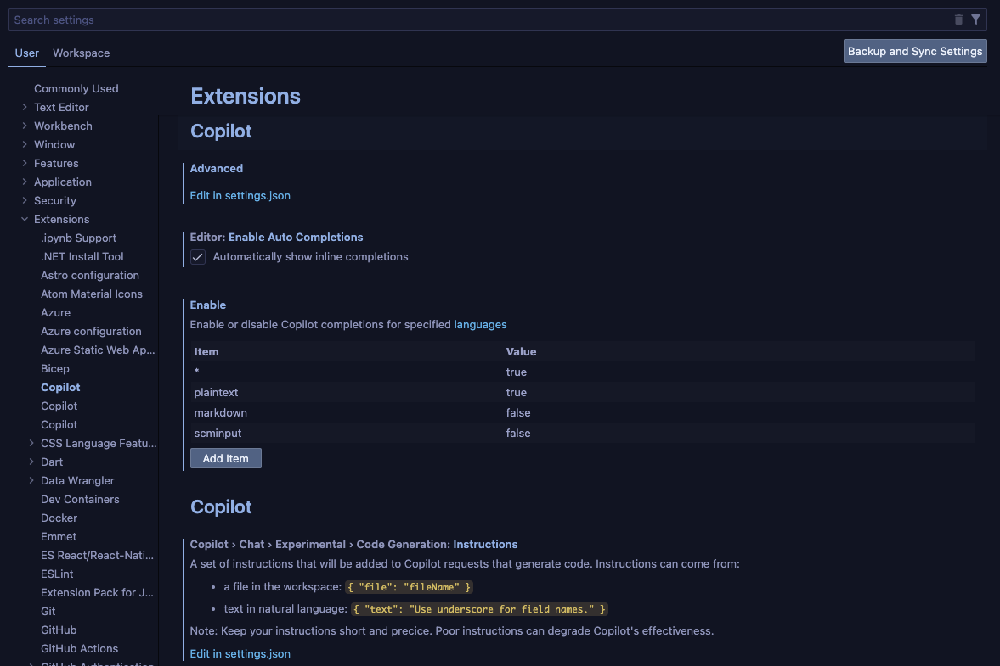

# Chapter 4 - Transformation of Jenkins Pipeline into GitHub using Copilot

## 4.1 Prerequisites

- Have a GitHub Copilot License, if you do not, let your management know and request a license
- Ideally have VSCode as that allows Copilot Custom Instructions

## 4.2 Prompts

In the folder called "pipelines" of this repository, you can find numerouns jenkins pipelines you can use to test the transformation capabilities. Let's open the repository in the VSCode and navigate to

```
./pipelines/test_pipeline/config.xml
```

now that we have this file opened, we can try to highlight the entirity of the code and try a couple of prompts in the Copilot Chat window:

1. what is this pipeline doing?

```
/explain this pipeline to me
```

2. add some documentation inline.

```
add some comments to the #selection
```

3. finally we can try to translate the code into GHA workflow format:

```
@workspace you are a GitHub Actions CICD engineer and you are taked with taking this Jenkins #selection pipeline and transform it into a GitHub Actions Workflow. If you make any assumptions, do let me know.
```

If the steps above worked, you should end up with something similar to the below:

```yml
name: CI Pipeline

on:
  schedule:
    - cron: "H/10 * * * *"

jobs:
  build:
    runs-on: [self-hosted, TeamARunner]
    env:
      DISABLE_AUTH: "true"
      DB_ENGINE: "sqlite"
    steps:
      - name: Checkout code
        uses: actions/checkout@v2

      - name: Build
        run: |
          echo "Database engine is $DB_ENGINE"
          sleep 80
          echo "DISABLE_AUTH is $DISABLE_AUTH"

  test:
    runs-on: [self-hosted, TeamARunner]
    steps:
      - name: Checkout code
        uses: actions/checkout@v2

      - name: Run tests
        run: |
          echo "Running tests"
          # Assuming the test results are generated in the target directory
          mkdir -p target
          echo "<testsuites></testsuites>" > target/test-results.xml

      - name: Publish test results
        uses: actions/upload-artifact@v2
        with:
          name: test-results
          path: target/*.xml
```

## 4.3 Setting Copilot Custom Instructions (Optional, for VSCode only)

Copilot Custom intructions give an opportunity to preprompt GitHub Copilot with a certain personality, role or simply an instruction, we can then save some keystrokes when prompting and can get more of similar tasks at scale in a shorter timespan.

Navigate to Settings menu of your VSCode and locate a submenu called Settings and another subsection Extensions and Finally Copilot as shown below:



We can then click on _Edit in settings.json_ link and add lines similar tho these into the file in the appropriate location.

```json
{ "text": "You are a devops engineer focusing on migrating from Jenkins into GitHub Actions." }
{ "text": "Reply with relevant snippets of GitHub Actions Workflow Files." }
```

We can then go into copilot chat and simply ask something along the lines of

```
refactor selection
```

Note: these custom instructions can also be all captured in the file and then referenced in settings.json such as

```json
{ "file": "fileName" }
```
